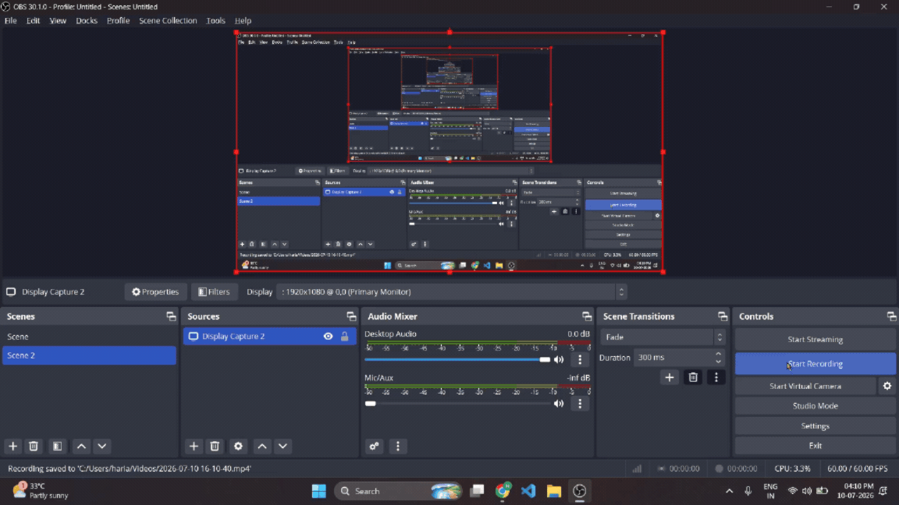
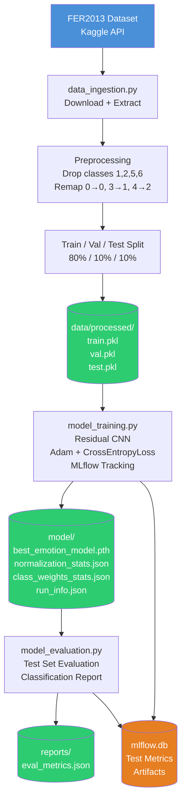
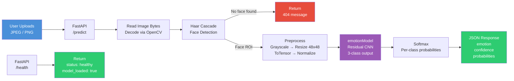
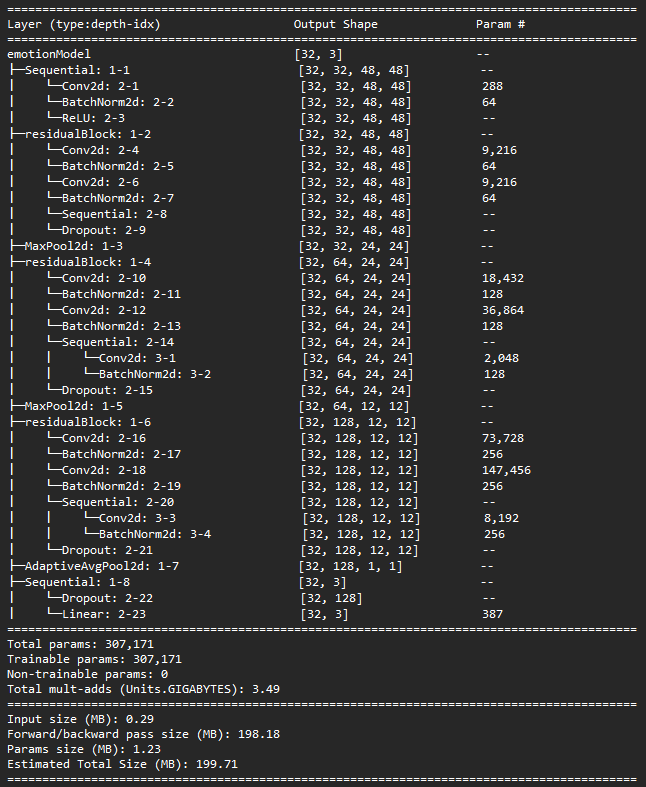

# Mood-Detector
An end-to-end emotion classification pipeline: from raw FER2013 data to containerized REST API, training and evaluation reproduction using DVC and expermentation tracking using MLFlow. 

## DEMO


```
docker build -t mood-detector:v1 .
docker run -p 8000:8000 mood-detector:v1
```

then open http://localhost:8000 in your browser

## Introduction
Most Deep Learning projects live in notebooks. This project demonstrates running experimentations, writing modular code, training custom architectural models from scratch, making it reproducible, using MLOps tools and techniques to make this project close to production ready, versioned and served. Closing the gap between "this works on my machine" and "this works in production".

## Architecture Overview
**Pipeline Diagram:**



---

**Serving Diagram:**



## MLflow Experiment Results

**Metrics across multiple runs**

| Metrics | RUN 1 | RUN 2 | RUN 3 | RUN 4 | RUN 5 |
|:---:|:---:|:---:|:---:|:---:|:---:|
| Best Validation F1 Score | 0.759 | 0.676 | 0.745 | 0.735 | 0.751 |
| Train Accuracy | 89.94 | 90.42 | 95.05 | 93.02 | 89.45 |
| Train Loss | 0.275 | 0.266 | 0.135 | 0.191 | 0.271 |
| Validation Accuracy | 71.95 | 66.26 | 67.24 | 73.43 | 74.56 |
| Validation Loss | 0.637 | 0.938 | 1.043 | 0.695 | 0.608 |
| Test Accuracy | 78.49 | 69.17 | 74.13 | 75.78 | 78.21 |
| Test Loss | 0.582 | 0.713 | 0.612 | 0.616 | 0.587 |
| Test F1 Score | 0.756 | 0.675 | 0.728 | 0.74 | 0.755 |

**Parameters across multiple runs**

| RUNS | Batch Size | Epochs | Learning Rate | Optimizer | Weight Decay | Class Weights |
|:---:|:---:|:---:|:---:|:---:|:---:|:---:|
| RUN 1 | 32 | 70 | 0.001 | Adam | 0.001 | True |
| RUN 2 | 32 | 70 | 0.0001 | Adam | 0.001 | True |
| RUN 3 | 32 | 70 | 0.001 | Adam | 0.0001 | True |
| RUN 4 | 64 | 70 | 0.001 | Adam | 0.001 | True |
| RUN 5 | 32 | 70 | 0.001 | Adam | 0.001 | False |

- Run 1 (baseline with class weights, lr=0.001, batch_size=32) achieved the best validation F1 score of 0.759.
- Run 2 (lr=0.0001, batch_size=32) shows clear overfitting - high training accuracy with significantly worse validation and test accuracy scores, confirming learning rate is too conservative for this architecture.
- Run 3 (lower weight decay) overfits too with training accuracy being 95.05% but validation and test accuracy only being 67.24% and 74.13% respectively.
- Run 4 (increased batch_size to 64) performed significantly well compared to Runs 2 and 3, converged earlier than others, but still show slight overfitting compared to baseline (Run1) and Run 5.
-  Run 5 (same parameters as Baseline, but without class weights(for loss function)), had similar results to Run 1(baseline) with slightly less overfitting and hence being used for the final application. 

## Model Details

**Architecture**

The model is a custom Residual Convolutional Neural Network (CNN) designed specifically for edge deployment on grayscale facial crops (48 x 48 pixels). It leverages residual connections to prevent vanishing gradients during backpropagation and heavily features dropout to counteract the noisy nature of the FER2013 dataset.



## Tech Stack

| Tool | Why |
|:---:|:---:|
| DVC | Data Versioning, pipeline reproducibility - `dvc repro` reruns only changed states |
| MLFlow | Experiment tracking and comparison across runs, model artifacts storage |
| FastAPI | Typed, async-capable inference serving with auto-generated docs |
| Docker | Eliminates environment dependency - `docker run -p 8000:8000 mood-detector:v1`|
| Haar Cascade | Lightweight face detection without a second model dependency |

## Project Structure
```
Mood-Detector/
├── .dvc
├── assets/
│   ├── demo.gif
│   └── model_summary.png
├── experiments/
│   └── experimentation.ipynb
├── reports/
│   ├── .gitignore
├── src/
│   ├── haarcascades/
│   │   └── haarcascade_frontalface_default.xml
│   ├── static/
│   │   └── index.html
│   ├── app.py
│   ├── custom_dataset.py
│   ├── custom_model.py
│   ├── data_ingestion.py
│   ├── engine.py
│   ├── model_evaluation.py
│   ├── model_training.py
│   ├── predict.py
│   └── utils.py
├── .dvcignore
├── .gitignore
├── .python-version
├── dockerfile
├── dvc.lock
├── dvc.yaml
├── pyproject.toml
├── README.md
├── requirements-docker.txt
└── uv.lock
```

## How to Run

- **Setup Kaggle API**
    - Go to the 'Account' tab on your Kaggle Profile.
    - Click 'Create New Token'. This will download a file named kaggle.json containing your API credentials.
    - Move this file to the appropriate location:
        - Linux/OSX: `~/.kaggle/kaggle.json`
        - Windows: `C:\Users\Windows-username\.kaggle\kaggle.json`

- **Clone the GitHub Repository**
    ```
    git clone https://github.com/hari-vash/Mood-Detector
    cd Mood-Detector
    ```

- **Configure virtual environment**
    ```
    # create the virtual envrionment
    uv venv .

    # activate the environment
    # macOS/linux
    source .venv/bin/activate
    # Windows
    .venv\Scripts\activate

    # install the dependencies
    uv sync
    ```

- **Install PyTorch with CUDA support (skip --index-url for CPU-only)**
    ```
    uv pip install torch torchvision --index-url https://download.pytorch.org/whl/cu126
    ```
    (Note:- The link provided for PyTorch installation is for Cuda Version: 12.6)

- **Reproduce Training from Scratch**
    ```
    dvc repro
    ```

- **Running the API locally**
    ```
    cd src
    uvicorn app:app --port 8000
    ```

- **Run via Docker(recommended) - from the root project directory**
    ```
    # build image
    docker build -t mood-detector:v1 .

    # run as a container
    docker run -p 8000:8000 mood-detector:v1
    ```
    then open http://localhost:8000

## What I'd Add for Production
- **Model Registry with promotion gates** - Currently the models go straight from training to serving. In production, a new model would have to beat the current production model's F1 on a held-out eval dataset. 
- **Data Drift Detection** - FER2013 being a lab-collected dataset, the real world data would be different, hence input distribution will diverge over time.
- **CI/CD Pipeline** - GitHub actions to run tests, validate model performance, build and push docker image. 
- **Retraining Trigger** - Current retraining is manual. In production it would be triggered by drift detection or on a schedule. 
- **GPU inference optimization** - Current serving uses CPU. For latency-sensitive production use "ONNX + TensorRT" quantization to reduce inference time significantly. 

# Known Limitations
- FER2013 is a lab-collected dataset with large class imbalance and noise.
- Haar cascade face detection is inconsistent and sometimes fails with non-frontal faces, poor lighting etc.
- 3-class scope is deliberate but limits applicability
- Model's performance and metrics reflects dataset noise, not architectural failure.

# Acknowledgement/Data
Dataset used is FER2013, downloaded from kaggle. You can find the dataset [here](https://www.kaggle.com/competitions/challenges-in-representation-learning-facial-expression-recognition-challenge/overview).
