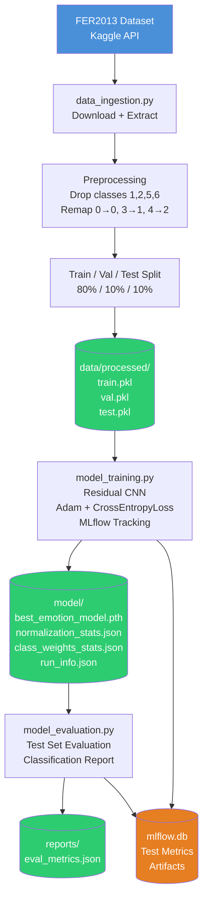
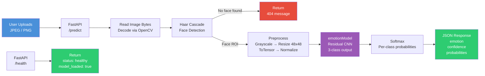

# Mood-Detector
An end-to-end emotion classification pipeline: from raw FER2013 data to containerized REST API, training and evaluation reproduction using DVC and expermentation tracking using MLFlow. 

## DEMO

`docker build -t mood-detector:v1 .`

`docker run -p 8000:8000 mood-detector:v1`

then open http://localhost:8000 in your browser

## Architecture Overview
**Pipeline Diagram:**

---

**Serving Diagram:**

